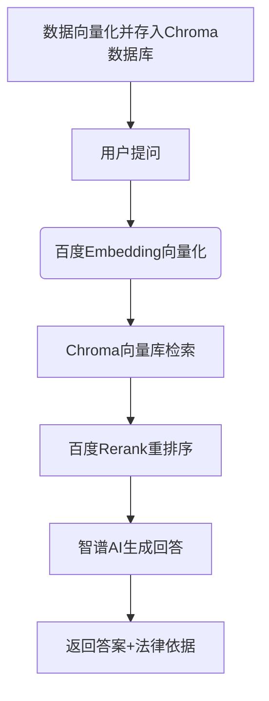

# ⚖️ 智能劳动法咨询助手

- [⚖️ 智能劳动法咨询助手](#️-智能劳动法咨询助手)
  - [前言](#前言)
  - [📌 核心功能](#-核心功能)
  - [🛠️ 技术架构](#️-技术架构)
  - [📂 项目结构](#-项目结构)
  - [🚀 快速开始](#-快速开始)
    - [前置要求](#前置要求)
    - [配置说明](#配置说明)
    - [启动系统](#启动系统)
  - [🔧 核心模块说明](#-核心模块说明)
    - [日志系统](#日志系统)
    - [数据处理](#数据处理)
    - [RAG流程](#rag流程)
  - [🌟 特色功能](#-特色功能)
  - [📜 许可证](#-许可证)

## 前言

> 本文所使用的大模型均通过 API 接口调用，未使用本地显卡运行大模型，请放心使用～

本文主要介绍了基于RAG（检索增强生成）技术的智能法律咨询系统，专门针对中国劳动法领域问题提供专业解答，并附带法律条文依据。
在线体验地址：[立即体验](https://ai.echo-silence.top)

## 📌 核心功能

- **精准法律问答**：基于最新劳动法律法规数据库，提供权威解答
- **条文溯源**：每个回答自动关联相关法律条款，支持查看原文
- **多模型集成**：
  - 百度文心：文本嵌入(Embedding)与重排序(Rerank)
  - 智谱AI：大语言模型生成回答
- **知识库管理**：支持JSON数据自动解析与向量存储更新

## 🛠️ 技术架构



## 📂 项目结构

```text
law-assistant
├──data/                                          # 数据存储目录（包含原始法律条文和向量数据库）
│   ├──storage/                                   # 向量数据库持久化存储
│   │   ├──721b632d-0262-45c8-8e15-e73dfc2a673a/  # ChromaDB的HNSW索引二进制文件（近似最近邻搜索用）
│   │   │   ├──data_level0.bin                    # 层级0的向量数据
│   │   │   ├──header.bin                         # 索引头信息
│   │   │   ├──length.bin                         # 向量长度信息
│   │   │   └──link_lists.bin                     # 图结构的连接关系
│   │   ├──chroma.sqlite3                         # ChromaDB的主数据库文件（SQLite3格式）
│   │   ├──docstore.json                          # 文档存储元数据
│   │   ├──graph_store.json                       # 知识图谱关系存储
│   │   ├──image__vector_store.json               # 图片特征的向量数据
│   │   └──index_store.json                       # 索引元数据
│   └──law.json                                   # 原始法律条文数据（JSON格式）
├──logs/                                          # 自动生成的日志文件目录
│   └──law_assistant_20250524.log                 # 按日期分割的日志文件（格式：YYYYMMDD）
├──src/                                           # 核心源代码目录
│   ├──common/                                    # 公共模块
│   │   ├──constants.py                           # 全局常量（日志级别、路径配置等）
│   │   ├──decorator.py                           # 装饰器工具（如 @timer 计时器）
│   │   ├──log.py                                 # 日志系统核心（多线程安全、颜色输出）
│   │   └──utils.py                               # 通用工具函数（如YAML文件读取）
│   ├──models/                                    # 模型实现
│   │   ├──embedding/                             # 文本嵌入模型
│   │   │   └──baidu.py                           # 百度文心Embedding模型封装
│   │   ├──llm/                                   # 大语言模型
│   │   │   └──zhipu.py                           # 智谱AILLM接口封装
│   │   └──rerank/                                # 检索结果重排序
│   │       └──baidu.py                           # 百度文心Rerank模型封装
│   ├──data_handler.py                            # 数据处理管道（JSON解析、向量库初始化）
│   ├──main.py                                    # Streamlit交互界面入口
│   ├──msg.py                                     # 消息模板管理
│   └──ragflow.py                                 # RAG流程核心（检索-重排序-生成）
├──README.md                                      # 项目说明文档
├──config.yaml                                    # 配置文件（API密钥等敏感信息）
└──requirements.txt                               # Python依赖库列表
```

## 🚀 快速开始

### 前置要求

- Python 3.12
- 百度/智谱API密钥（配置于`config.yaml`）
- 安装依赖：`pip install -r requirements.txt`

### 配置说明

配置文件`config.yaml`中可以进行个性化修改：

  ```yaml
  rag:
    top_k: 10  # 扩大初始检索数量
    rerank_top_n: 5  # 重排序后保留数量
    rerank_min_score: 0.5 # 重排序后最低分阈值
    llm_temperature: 0.3 # 大模型采样温度
    llm_top_p: 0.9 # 大模型核取样
  baidu_api:
    api_key: "您的百度API Key"
    embedding_model: "bge-large-zh" # 支持：bge-large-zh、bge-large-en、tao-8k、embedding-v1(384维，不可用)
    rerank_model: "bce_reranker_base" # 其他没测试
  zhipu_api:
    api_key: "您的智谱API Key"
    llm_model: "GLM-4-Plus" # 支持 glm-z1-air、glm-z1-airx、glm-z1-flash、GLM-4-Air-250414、GLM-4-Plus、GLM-4-AirX等（z1系列带思维链）
  ```

API_KEY 申请链接：

- [智谱AI开放平台 API_KEY 申请链接](https://open.bigmodel.cn/usercenter/proj-mgmt/apikeys)
- [百度智能云 API_KEY 申请链接](https://console.bce.baidu.com/iam/#/iam/apikey/list)

### 启动系统

在项目根目录下执行

```bash
streamlit run src/main.py
```

首次启动项目时，可能会比较慢。这是因为项目初始化的时候，`data` 目录下只有 `law.json` 数据，首次执行会对数据进行向量化处理，并创建索引以及将数据存入 `Chroma` 数据库等操作。

## 🔧 核心模块说明

### 日志系统

- 多线程安全日志器
- 自动按日期分割日志文件
- 支持动态配置日志级别/输出目标
- 示例用法：

  ```python
  from common.log import get_logger
  logger = get_logger("custom_module")
  ```

### 数据处理

- 自动验证JSON法律文件结构
- 稳定ID生成策略
- 向量存储自动更新机制

### RAG流程

1. 混合检索（密集+稀疏）
2. 基于相关度重排序
3. 带法律约束的答案生成

## 🌟 特色功能

- **智能过滤**：自动识别非法律问题
- **思考可视化**：展示模型推理过程
- **参考条文展开**：直接查看法律原文
- **切换模型**：可通过 `config.yaml` 文件选择模型，特别是**有无带有思维链的LLM大模型**

## 📜 许可证

MIT License
